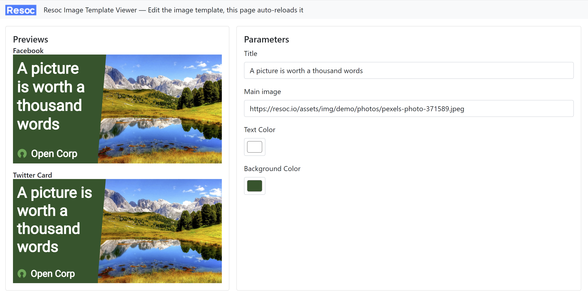
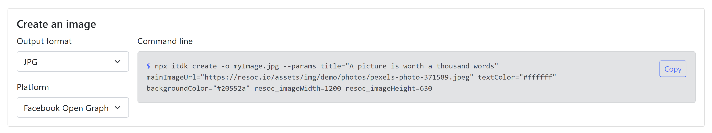

# Resoc Image Template Development Kit

Generate personalized, content-rich, branded images for social media and other purposes:

- *You* create an image template using HTML and CSS, *once for all*
- *Resoc* generates *thousands* of images based on this template

## Instant tutorial

    cd my-new-resoc-template
    npx itdk init
    # ... and follow the white rabbit

## Features

The features you need to get the job done easily:

- Viewer for OpenGraph/Facebook and Twitter Card images, with auto-reload
- Integrate Resoc to your CI/CD via command line or from your JS code
- Parameter declaration so you clearly define what your template is expecting: a post title, an author profile picture...

## Image templates

https://github.com/Resocio/resoc/tree/main/packages/cli-itdk/starter-templates/basic

## View and debug

You can view a template in action with:

    npx itdk view path/to/resoc.manifest.json

The command opens a browser with the viewer:

It parses your image template manifest and shows a form, matching the template's parameters.
Edit the values to see the result.

At the bottom of the viewer, a sample command line lets you generate the corresponding image:

## Generate

### Image template development kit / Viewer

While creating your template, you might want to create an image, just to make sure you get the expected outcome.
For this, use the command line displayed by the viewer itself.

### Command line

When your template is ready and you want to integrate it to your CI/CD, use the `create-img` tool:

    npm install -g create-img
    create-img path/top/resoc.manifest.json -o myImage.jpg --params title="A picture is worth a thousand words" mainImageUrl="https://resoc.io/assets/img/demo/photos/pexels-photo-371589.jpeg" textColor="#ffffff" backgroundColor="#20552a" resoc_imageWidth=1200 resoc_imageHeight=630

As this tool has the same interface as the image template development kit, feel free to start from a command line
dump by the viewer.

### API

You can call the image generation right from your code. Install the package:

    npm install @resoc/create-img

Then:

    import { compileLocalTemplate } from "@resoc/create-img"

    compileLocalTemplate(
        'path/to/resoc.manifest.json',
        {
            title: 'A picture is worth a thousand words',
            mainImageUrl: 'https://resoc.io/assets/img/demo/photos/pexels-photo-371589.jpeg',
            textColor: '#ffffff',
            backgroundColor: '#20552a',
            resoc_imageWidth: '1200',
            resoc_imageHeight: '630'
        },
        'output.png');
